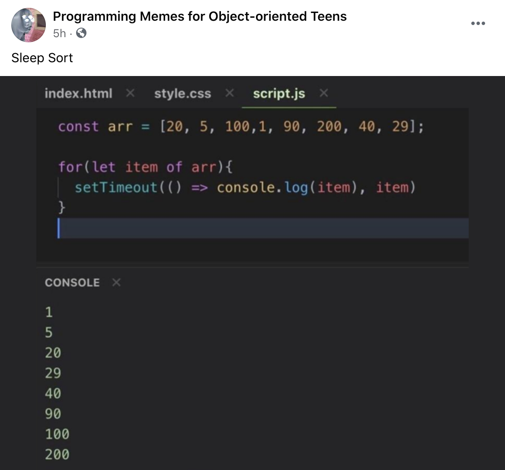

# I'm Learnding

## About
I have so many questions about tech, about life. Here is where I find out answers to those questions.

## Questions

### What happens when you type in a URL and hit enter in your browser?

### How do URLs work?
Someone linked their website ("Go to example-website.com!") but people had reported that it only worked when you prepended the address with `www.`. I imagine this has something to do with the CNAME?

### What are some good beginner front end resources?
- [The 2021 Web Development (Frontend + Backend) RoadMap](https://dev.to/javinpaul/the-2019-web-development-frontend-backend-roadmap-4le2)

### How does `async/await` work?
- [JavaScript Visualized: Promises & Async/Await](https://dev.to/lydiahallie/javascript-visualized-promises-async-await-5gke)

### Does ['sleep sort'](https://www.facebook.com/ooteensmemes/posts/2793735160889541) work in practice?

- Loek Janssen: "This does not guarantee the correct sorted result. In javascript runtimes the setTimeout callbacks are added to the event loop and executed if it takes precedence to other items waiting to be executed. Hypothetically, the setTimeout callbacks can be displayed to stdout in a different order."

### How does Docker work and what are some use cases?
- [Docker Demystified](https://dev.to/frosnerd/docker-demystified-27kl)

### What is Kubernetes. Mum come pick me up I'm scared
- [Kubernetes Tutorial: Learn the Basics and Get Started](https://dev.to/scalyr/kubernetes-tutorial-learn-the-basics-and-get-started-5dgh)

### React Native
- [I picked up React Native as a web developer and here's what I've learned](https://dev.to/walaura/i-picked-up-react-native-as-a-web-developer-and-here-s-what-i-ve-learned-59h6)

## Read later

- [JavaScript Visualized: the JavaScript Engine:](https://dev.to/lydiahallie/javascript-visualized-the-javascript-engine-4cdf) how the JS engine turns human-friendly JS code into something machines understand.
- [Creating a basic Slack clone with Postgres and React Hooks](https://dev.to/supabase/creating-a-basic-slack-clone-with-postgres-and-react-hooks-4iep)
- [I Passed The Google Technical Interviews; You Can Too.](https://dev.to/emmabostian/i-passed-the-google-technical-interviews-you-can-too-4i6m)
- [Why Facebook's api starts with a for loop](https://dev.to/antogarand/why-facebooks-api-starts-with-a-for-loop-1eob)
- [29 Must Read Books For Programmers](https://dev.to/bosepchuk/29-must-read-programming-books-2n45)
- [Understanding This, Bind, Call, and Apply in JavaScript](https://dev.to/digitalocean/understanding-this-bind-call-and-apply-in-javascript-dla)
- [What is CORS?](https://dev.to/jpomykala/what-is-cors-11kf)

## Resources
- [How to write a kickass README](https://dev.to/scottydocs/how-to-write-a-kickass-readme-5af9)
